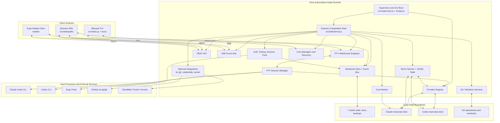

# Phase 3 — Architecture Analysis

> **Scope:** This document explains the architecture and architectural intent of the reference repository. It is not an implementation guide and does not recommend copying the code.

## System Overview

Myrlin Workbook is a **local-first, host-authoritative modular monolith** for managing AI coding CLI sessions. A Node.js process running on the developer's workstation owns the durable Workbook state, launches and supervises terminal processes, integrates with provider-owned conversation stores, and exposes the system to browser and mobile clients.

The architecture separates four kinds of responsibility:

1. **Coordination state owned by Workbook**
   Projects/workspaces, session metadata, layouts, settings, templates, tasks, paired devices, and other organizational records are persisted locally by Workbook.

2. **Conversation state owned by AI CLI providers**
   Claude Code and Codex continue to own their transcript files and session identities. Workbook discovers, parses, searches, resumes, and mirrors those records rather than replacing the provider's storage.

3. **Live execution owned by the host server**
   Long-running PTY processes live in the server, not in the browser. Clients attach to those processes, send input, receive output, and reconnect after refreshes.

4. **Multiple client surfaces over shared contracts**
   The browser SPA is the canonical desktop surface, the older Blessed TUI is a secondary/legacy interface, and the Expo mobile app is a separate client. They converge on the same host-owned state and operations.

The resulting system is best described as:

> **A single-user orchestration server with local persistence, provider adapters, process supervision, and multiple control clients.**

### Architectural characteristics

- **Local-first:** Core state remains on the workstation. External services are used only for provider CLIs or optional integrations.
- **Single host authority:** The server is the source of truth for process state and Workbook metadata.
- **Provider-adapted:** Claude and Codex differences are isolated behind a provider registry and capability contract.
- **Event-driven at runtime:** Store changes, provider filesystem changes, PTY output, and task transitions are propagated as events.
- **Transport-specialized:** REST handles commands and snapshots, SSE handles state notifications, and WebSockets carry interactive terminal traffic.
- **Filesystem-oriented:** Workbook uses JSON and local document files; providers use their own JSONL stores; Git repositories provide worktree/task state.
- **Progressively extracted monolith:** `src/web/server.js` remains the composition root and largest integration surface, while auth, pairing, push, PTY, mirror, credentials, and other subsystems are extracted modules.

## Architecture Diagram



### Architectural boundaries

| Boundary | Workbook owns | Workbook does not own |
|---|---|---|
| **Coordination** | Project/session relationships, task state, settings, UI organization, device records | Provider account/session semantics beyond exposed capabilities |
| **Conversation history** | References, titles, cached/derived metadata | Canonical provider transcripts |
| **Execution** | PTY process lifecycle, client attachment, scrollback, status propagation | AI model execution itself |
| **Version control** | Worktree orchestration, status, diffs, merge/push actions | Repository hosting or Git's data model |
| **Clients** | API contracts and real-time events | Browser/mobile process ownership |
| **Remote access** | Authentication and optional tunnel control | Cloudflare or Expo service availability |

## Module Breakdown

### 1. Boot, Supervision, and Configuration

| Module | Responsibility | Why it Exists | Inputs | Outputs | Dependencies | Communication with Other Modules |
|---|---|---|---|---|---|---|
| **Process supervisor** — `src/supervisor.js` | Launch the GUI runtime, restart it after failures, apply restart backoff, and stop automatic restart during a rapid crash loop. | An always-on local control plane needs stronger process lifecycle behavior than a one-shot Node command. | CLI arguments; process environment; child exit codes and timing. | Running GUI child; logs/PID information; manual-review lock on repeated fast failures. | Node process and child-process facilities; crash logger; host OS behavior. | Spawns `src/gui.js`, observes its exit, and becomes the outer failure boundary for the server. |
| **GUI entrypoint** — `src/gui.js` | Initialize providers, seed demo data when requested, start the HTTP server, issue a one-time startup token, snapshot frontend assets, and optionally open a browser. | Boot ordering must ensure provider services and state are ready before clients connect. | Environment (`PORT`, `CWM_HOST`, open-browser flags); CLI flags such as demo/CDP; shared store. | Listening server; login URL; initialized provider registry; shutdown handlers. | Store; provider registry; server; auth startup token; frontend backup. | Calls provider initialization before `startServer`; passes provider-change callbacks into the server; coordinates graceful process shutdown. Evidence: `src/gui.js:49-76`. |
| **TUI entrypoint** — `src/index.js` | Start the Blessed terminal UI, initialize shared state, reconcile stale sessions, and support demo/reset modes. | The project originated as a terminal workspace manager and retains a non-browser surface. | CLI flags; shared store; terminal input. | Rendered TUI; session/workspace commands; notifications. | Core managers; recovery; `src/ui/`; store. | Uses the same durable store and core session managers but does not use the browser rendering path. Evidence: `src/index.js:18-74`. |
| **Configuration and authentication loader** — primarily `src/web/auth.js` plus boot environment | Resolve host/password/auth settings and initialize runtime tokens. | A local app must be easy to launch while remaining protected when exposed to LAN or tunnel clients. | `CWM_PASSWORD`; `~/.myrlin/config.json`; project-local state config; generated defaults; startup flags/environment. | Effective password/configuration; one-time token; active token registry; auth middleware. | Filesystem; crypto; store-backed paired devices. | Injects auth middleware into server routes and WebSocket/SSE handling; reloads persistent paired-device tokens from the store. |

#### Configuration precedence and sources

The architecture uses layered configuration rather than one central configuration object:

1. **Process environment and CLI flags** define deployment/runtime concerns: host, port, password override, browser opening, demo mode, and diagnostic options.
2. **User-level config** under `~/.myrlin/` provides persistent host credentials and Workbook state.
3. **Project-local/legacy config** is used as a fallback where supported.
4. **Persisted Workbook settings** control providers, terminal behavior, notifications, automation, optional integrations, and UI preferences.
5. **Provider-owned configuration** remains with the provider unless Workbook exposes a deliberate per-session override.
6. **Mobile configuration** is local to the app: active server, token, theme, and user preferences are retained through Zustand and secure storage.

For the main password, the effective precedence is:

```text
CWM_PASSWORD
    ↓
~/.myrlin/config.json
    ↓
project/local state config
    ↓
auto-generated credential persisted for later starts
```

Provider enablement is loaded after the store. Claude remains the baseline provider, while optional providers such as Codex are initialized only when enabled. Optional integrations—Anthropic API features, `td`, GitHub CLI, tunnel management, Mac credential bridge, and push—activate only when their configuration and external dependencies exist.

### 2. Core Domain and Persistence

| Module | Responsibility | Why it Exists | Inputs | Outputs | Dependencies | Communication with Other Modules |
|---|---|---|---|---|---|---|
| **Workbook store** — `src/state/store.js` | Hold the authoritative in-memory coordination model and persist workspaces, sessions, groups, settings, templates, features, tasks, devices, and provider metadata. Emit domain events when records change. | The server, TUI, mobile clients, task services, and notifications need one consistent model of Workbook-owned state. | Initial state files; mutation calls from routes/core managers; disk-change checks. | Updated in-memory state; atomic persisted snapshots; domain events; query results. | Filesystem; event emitter; docs/state helpers; schema migration and backup logic. | Read and mutated by server/core modules; events feed SSE, push, notifications, and task status; mtime checks reconcile another local process modifying the same file. |
| **Docs manager** — `src/state/docs-manager.js` | Store and retrieve project documentation separately from transient UI state. | Notes, goals, rules, and roadmap content need durable, human-readable project context rather than being embedded only in conversation transcripts. | Workspace identity; document/section edits. | Workspace documentation and section updates. | Local filesystem; workspace records. | Called by the store/server's Docs routes and returned to browser/mobile clients. |
| **Workspace manager** — `src/core/workspace-manager.js` | Provide domain operations around project/workspace organization. | Workspace rules and lookups should not be tied to one UI surface. | Workspace commands and state. | Created/updated/deleted workspace results. | Store. | Used by the TUI/core flow and conceptually mirrored by web API routes. |
| **Session manager** — `src/core/session-manager.js` | Provide the non-embedded/native-terminal session launch path and shared lifecycle operations. | The TUI launches visible OS terminals, whereas the GUI embeds managed PTYs; both need a provider-aware session concept. | Session metadata; working directory; provider/model/permission options. | Spawned native terminal process; updated session state; launch errors. | Store; provider-specific flags; OS shell/process facilities. | Used by the TUI and core workflows. The GUI's interactive process ownership is delegated to `pty-manager.js`. |
| **Recovery and process tracking** — `src/core/recovery.js`, `src/core/process-tracker.js` | Compare persisted process records with real host processes and reconcile stale sessions after restart. | Durable records can outlive PIDs; treating stored “running” state as truth would mislead users. | Persisted sessions/PIDs; host process-liveness checks; auto-recovery setting. | Stopped/recovered/error session transitions; recovery summary. | Store; session manager/provider launch; OS process APIs. | Runs during startup and maintenance; writes corrected status through the store and generates notifications. |
| **Notification service** — `src/core/notifications.js` | Normalize and retain local activity/completion/error notifications. | Multiple modules need one way to surface attention-worthy events independent of a specific UI. | Session/task/recovery events. | Notification records and UI-consumable events. | Store/core event sources. | Consumed by TUI/browser notification surfaces; remote delivery is separately handled by push. |
| **`td` adapter** — `src/core/td-adapter.js` | Translate optional repository-native `td` commands and records into Workbook operations. | `td` remains a separate source of repository task truth; Workbook integrates it without absorbing its storage model. | Repository path; `td` command/issue data. | Normalized issue/task results and command outcomes. | External `td` CLI; repository filesystem. | Called by server integration routes; promoted issues feed worktree/session creation. |

#### State ownership model

The system intentionally has several state classes with different durability:

| State class | Owner | Persistence | Examples |
|---|---|---|---|
| **Workbook coordination state** | `Store` | Local JSON plus backups | Workspaces, session metadata, task records, templates, settings, paired devices |
| **Project documentation** | Docs manager | Local document files | Notes, goals, rules, roadmap |
| **Provider conversation state** | Claude/Codex | Provider-owned JSONL/session stores | Messages, provider UUIDs, usage records |
| **Repository state** | Git | `.git` and worktrees | Branches, diffs, commits, conflicts |
| **Live runtime state** | Server process | In memory; reconciled after restart | PTY objects, WebSocket clients, SSE clients, browser tokens, pending worker jobs |
| **Mobile local state** | Mobile app | Secure storage/local app persistence | Active server, paired token, app settings, local cache |

This separation explains why Workbook can recover organization after a crash without pretending it owns the provider's canonical conversation log or Git's branch history.

#### Persistence strategy

The store uses a single local coordination document with schema migration, atomic replacement, debounced writes where appropriate, and multiple backup tiers. This keeps installation and inspection simple while adding protection against partial writes and destructive state drift.

Persistence is not the same as process recovery:

- **Persistence** restores what Workbook knew.
- **Recovery** checks whether the corresponding process still exists and updates the stored status.
- **Provider rediscovery** verifies whether the provider transcript still exists.
- **Git inspection** reconstructs branch/worktree truth independently of the task record.

The GUI and TUI can potentially touch the same state. The web server therefore checks the persisted file's modification time on read paths and reloads changed state instead of assuming its in-memory copy is always the only writer (`src/web/server.js:537-542`).

### 3. Provider Layer

| Module | Responsibility | Why it Exists | Inputs | Outputs | Dependencies | Communication with Other Modules |
|---|---|---|---|---|---|---|
| **Provider registry** — `src/providers/index.js` | Register providers, validate their required contract, initialize enabled providers, resolve providers by ID, and expose capability information. | The rest of the product needs provider-neutral operations instead of scattered Claude/Codex branches. | Provider objects; store settings; provider-change callback. | Enabled provider list; resolved provider adapters; initialization/change events. | Store; provider implementations. | Used by discovery, spawn, search, cost gating, idle detection, mirrors, and server routes. Provider changes are forwarded to SSE/discovery refresh. Evidence: `src/providers/index.js:264-325`. |
| **Claude provider** — `src/providers/claude/` | Understand Claude's transcript layout, session parsing, search, spawn/resume commands, idle signals, cost support, and mirror line format. | Claude Code is the original provider and has provider-specific storage and CLI semantics. | Claude local transcripts; session/launch options; search/mirror requests. | Normalized discovered sessions; spawn descriptor; parsed transcript/messages; capability results. | Claude Code CLI and local Claude data. | Called only through the provider contract by server/core services; provider-owned data remains canonical. |
| **Codex provider** — `src/providers/codex/` | Provide equivalent discovery, parsing, spawn, search, mirror, and settings behavior for Codex; watch Codex session directories. | Codex uses different file layouts, flags, capabilities, and session-change behavior. | Codex session files; provider settings; launch/search requests. | Normalized sessions; spawn descriptor; parsed messages; provider-change events. | Codex CLI and local Codex data; filesystem watcher. | Registry initializes its watcher; changes trigger discovery refresh; UI capability gating prevents unsupported cost/behavior from appearing as valid. |

#### Provider contract intent

The provider abstraction isolates differences in:

- Session discovery location and transcript format.
- Launch and resume command construction.
- Search behavior.
- Idle/completion signals.
- Keyboard and terminal behavior.
- Cost availability.
- Mirror parsing and artifact lookup.

Capabilities are explicit rather than assumed. For example, a provider can state that cost is unsupported instead of returning a misleading zero. Optional capabilities are detected before use. This allows the core workspace model to remain stable while individual providers vary.

The registry is static and code-defined rather than a runtime plugin marketplace. That gives the project stronger control over compatibility but requires a release to add a new provider.

### 4. Web Server and Service Layer

| Module | Responsibility | Why it Exists | Inputs | Outputs | Dependencies | Communication with Other Modules |
|---|---|---|---|---|---|---|
| **Express composition root** — `src/web/server.js` | Assemble middleware, public/authenticated routes, core CRUD, service modules, SSE broadcasting, cost workers, worktree/Git operations, and server lifecycle. | A single host process needs one integration point for clients and local services. | HTTP requests; shared store; provider callbacks; service configuration. | REST responses; SSE events; server/listener handles; service commands. | Nearly every server/core subsystem. | Injects auth/store/broadcast functions into extracted modules; translates client commands into store/provider/PTY/Git actions. Evidence: `src/web/server.js:207-322`, `src/web/server.js:350-397`. |
| **Authentication service** — `src/web/auth.js` | Resolve password configuration, issue browser and device bearer tokens, validate requests, rate-limit authentication, and rehydrate persistent device tokens. | LAN/tunnel exposure must not grant anonymous control over terminals and repositories. | Password/token login requests; startup token; paired-device state. | Auth middleware; active bearer tokens; login/refresh responses. | Crypto; filesystem config; store. | Protects REST/SSE/WebSocket operations; pairing exchanges temporary codes for persistent device tokens. |
| **Pairing service** — `src/web/pairing.js` | Generate QR/manual pairing payloads and exchange short-lived pairing codes for device credentials. | Mobile onboarding should not require typing a long host credential or knowing which host URL is reachable. | Authenticated pairing-code request; network interfaces/tunnel URLs; mobile device details. | QR payload; paired-device token and metadata. | Auth service; store; host network discovery. | Browser requests a code; mobile exchanges it; device record is persisted and used by device/push services. |
| **Device manager** — `src/web/device-manager.js` | List, update, subscribe, test, and revoke paired devices. | The operator needs explicit control over remote clients, especially lost or obsolete devices. | Device CRUD/subscription requests; authenticated device identity. | Updated records; revoked credentials; closed client connections. | Store; auth token registry; SSE clients; push service. | Revocation invalidates auth and closes the device's live event connection; subscription changes affect SSE filtering. |
| **Push service** — `src/web/push.js` | Convert selected domain events into batched, preference-aware Expo notifications. | A user away from the host needs alerts without keeping a live UI open. | Store/session/task/conflict events; device push tokens/preferences. | Expo push requests; stale-token cleanup; test-push results. | Store events; paired devices; Expo Push API. | Listens to store transitions, queues/coalesces alerts, and updates device records when a push token becomes invalid. |
| **Cost worker** — `src/web/cost-worker.js` | Parse transcript usage and calculate cost outside the main event loop. | Large transcript analysis must not block terminal I/O or HTTP responsiveness. | Transcript paths/data; period/model pricing requests. | Cost and token summaries or worker errors. | Worker threads; provider cost data; pricing table. | Server lazily dispatches cost jobs and maps worker responses to API requests; unsupported providers are capability-gated. |
| **File manager** — `src/web/file-manager.js` | Browse and edit project files through constrained server operations. | The GUI needs a project file surface without giving the browser arbitrary filesystem access. | Validated project-relative paths; read/save requests. | File tree, content, save results. | Local filesystem; path-safety rules. | Called by file API routes and consumed by the browser editor. |
| **Scheduler** — `src/web/scheduler.js`, `scheduler-routes.js` | Persist/execute one-time or recurring messages sent to live sessions. | Delayed or repeated terminal prompts need a server-owned timer that survives client navigation. | Schedule CRUD; active session ID; message and timing. | Schedule records/history; PTY writes at execution time. | Store/timers; PTY manager; routes. | Routes manage schedules; execution uses the same live PTY session ownership as manual input. |
| **Frontend fallback** — `src/web/backup.js` | Snapshot and restore browser frontend assets. | The API/server may still be healthy when a bad frontend bundle makes the UI inaccessible. | Successful startup; fallback status/restore command. | Last-known-good asset copy; restore result. | Local filesystem; GUI boot. | GUI snapshots assets after startup; server exposes fallback status/restore operations. |

#### Server structure

`src/web/server.js` is both a **composition root** and a large set of inline route handlers. Its architectural roles are:

1. Build the Express application and common middleware.
2. Establish public health/connection endpoints.
3. Initialize auth, pairing, device, push, credentials, and other extracted route groups by dependency injection.
4. Expose CRUD and command routes for domain operations.
5. Maintain the SSE client registry and broadcast function.
6. Attach the PTY WebSocket server to the same HTTP listener.
7. Own server-scoped workers and services whose lifetime matches the server.

The design is modular at service boundaries but monolithic at composition and many product routes. The browser receives one cohesive local API even though some internal concerns have moved to dedicated modules.

### 5. PTY and Live Transcript Architecture

| Module | Responsibility | Why it Exists | Inputs | Outputs | Dependencies | Communication with Other Modules |
|---|---|---|---|---|---|---|
| **PTY session manager** — `src/web/pty-manager.js` | Spawn and own provider CLI processes, maintain scrollback, attach/detach clients, accept input/resizes, detect output/status, and preserve sessions across client refreshes. | Browsers cannot own native terminal processes, and the process must survive a tab reload or multiple viewers. | Session/working directory/provider settings; client input; resize/activation messages. | PTY output; control frames; process exit/status; scrollback replay. | `node-pty`; provider registry; store; filesystem/transcript detection. | Gets spawn descriptors from providers; broadcasts bytes to WebSocket clients; updates session state; feeds completion/attention behavior. Evidence: `src/web/pty-manager.js`. |
| **PTY WebSocket server** — `src/web/pty-server.js` | Authenticate and route `/pty` WebSocket upgrades to the correct PTY session. | Interactive terminal traffic is bidirectional and byte-oriented, unlike ordinary API data. | HTTP upgrade; auth token; session identity; WebSocket messages. | Attached WebSocket client and PTY data stream. | HTTP server; auth; PTY manager; WebSocket library. | Shares the main HTTP listener but delegates process ownership to the PTY manager. |
| **JSONL tailer** — `src/web/jsonl-tailer.js` | Incrementally follow an append-only provider transcript and recover from missed filesystem events or file resets. | Live external sessions must be observed without repeatedly parsing the entire transcript. | Transcript file path; filesystem changes; history request. | New raw lines; reset/history events. | Filesystem watch/poll. | Used by Mirror Service; provider adapter interprets each line. |
| **Mirror service** — `src/web/mirror-service.js` | Manage read-only subscriptions to externally running sessions and normalize provider transcript changes into client events. | Resuming an externally driven session can interfere with it; observing should be non-invasive. | Open/close/history commands; provider/session identity; tailer lines. | Normalized mirror messages/status/reset events over SSE. | Provider registry; JSONL tailer; SSE broadcaster; subscriber lifecycle. | Resolves provider-specific parsing through the registry and emits provider-neutral events to browser/mobile clients. |

#### Terminal data path

```text
Browser terminal input
    → authenticated /pty WebSocket
    → PTY session manager
    → provider-generated spawn/process contract
    → Claude/Codex CLI process

CLI output
    → PTY session manager
    → scrollback buffer + status detection
    → all attached WebSocket clients
    → browser terminal rendering
```

The PTY process is intentionally independent of any one WebSocket. A browser refresh disconnects a client, not the underlying CLI. On reconnect, the server replays retained scrollback. Viewport ownership and backpressure handling exist because several clients can observe one PTY with different screen sizes and network speeds.

The mirror path is deliberately separate:

```text
Externally launched provider session
    → provider-owned JSONL transcript
    → JSONL tailer
    → provider mirror parser
    → Mirror Service
    → SSE mirror events
    → read-only browser/mobile view
```

This avoids treating “observe” and “take control” as the same operation.

### 6. Git, Worktree, and External Integration Layer

| Module | Responsibility | Why it Exists | Inputs | Outputs | Dependencies | Communication with Other Modules |
|---|---|---|---|---|---|---|
| **Git manager** — `src/web/git-manager.js` | Normalize status, branches, logs, diffs, commit inspection, and repository actions. | Worktree/task orchestration needs Git information without coupling the UI to command output formats. | Repository path; branch/hash/action request. | Structured Git status/diff/log/action results. | Git via `simple-git` or process invocation. | Called by task/review/conflict routes and returned to browser/mobile clients. |
| **Git status cache** — `src/web/git-status-cache.js` | Reuse short-lived Git status results across frequent UI/conflict requests. | `git status` across many active sessions is expensive and can degrade the control plane. | Repository/session identity; refresh request. | Cached or refreshed status. | Git manager; time-based cache. | Feeds conflict detection and workspace/session status without changing Git's source of truth. |
| **Worktree task orchestration** — store + server task routes + Git services | Create isolated branches/worktrees, launch provider sessions, track task state, expose review data, and integrate or reject work. | Parallel agents need filesystem isolation and a lifecycle beyond “process started/stopped.” | Task spec, repo/base branch, prompt/model/options, task transition or review action. | Worktree/branch; launched session; task state; diff/review/merge/push result. | Store; Git manager; PTY/session management; provider registry; optional GitHub CLI. | Coordinates several modules through server routes; task/store events feed SSE, push, and board updates. |
| **Credential manager and routes** — `src/web/credential-manager.js`, `credential-routes.js` | Manage local Claude account snapshots, refresh/account state, and safe active-account switching. | Multi-account users need machine-wide credential switching without manual file replacement. | Credential files; account selection; refresh/apply request; settings. | Active credential state; usage/account metadata; structured warnings. | Local credential files; provider OAuth endpoints; store settings. | Exposed through server routes; optional Mac bridge receives a successful local switch as a secondary action. |
| **Mac bridge** — `src/web/mac-bridge.js` | Optionally propagate credential state to a second configured Mac host. | A specialized multi-host workflow needs coordinated account state. | Bridge config; selected credential snapshot. | Remote apply result/warning. | SSH/SCP and remote profile tooling. | Called by credential workflow; failure does not redefine the local host's successful state. |
| **Tunnel/remote services** | Start, stop, and report optional quick/named tunnel state. | A local server may need controlled remote reachability without becoming a hosted SaaS. | Tunnel configuration/token; start/stop/status command. | Reachable URL and tunnel process status. | `cloudflared`; optional Cloudflare Access configuration. | Server routes expose status/control; pairing can include tunnel URLs in mobile onboarding. |
| **GitHub/PR integration** | Push a task branch, generate a PR description, create a PR, and monitor integration status. | Worktree output may need remote human/team review instead of immediate local merge. | Reviewed branch; remote/repository metadata; PR request. | Push/PR URL/status; optional generated description. | Git; `gh`; optional AI description generation. | Layered on worktree review routes; PR state updates task/orchestration views. |

The integration approach is intentionally **adapter-and-shell oriented**. Git, `gh`, `td`, provider CLIs, and `cloudflared` remain external tools. Workbook invokes them and normalizes results rather than reimplementing their domains.

### 7. Client Architecture

| Module | Responsibility | Why it Exists | Inputs | Outputs | Dependencies | Communication with Other Modules |
|---|---|---|---|---|---|---|
| **Browser SPA** — `src/web/public/` | Render the canonical desktop workspace, maintain client-side view state, invoke REST commands, subscribe to SSE, and render/connect terminal panes over WebSocket. | A dense multi-pane control surface benefits from a local browser UI without a desktop-app packaging layer. | API snapshots; SSE events; PTY frames; user interactions and local UI preferences. | REST commands; PTY input/resize; rendered workspace, tasks, docs, costs, settings, files, and terminals. | Server API; SSE; WebSocket; browser storage and DOM. | REST fetches authoritative data; SSE triggers updates/refetch/rendering; WebSocket is reserved for terminal streams. |
| **Mobile API client** — `mobile/services/api-client.ts` | Provide a typed wrapper around host REST operations and mobile-aware error/offline behavior. | Mobile screens need one authenticated API contract and consistent network failure handling. | Active server URL/token; request payload. | Parsed API data; API errors; queued supported mutations. | Host API; offline queue; secure credentials. | Used by TanStack Query and mobile screens; pairing is intentionally unauthenticated until a token is issued. |
| **Mobile SSE client** — `mobile/services/sse-client.ts` | Maintain a real-time event connection and dispatch host events to mobile state/query logic. | Mobile data must stay current without frequent polling. | Server URL/token; event handler. | Parsed events and connection status. | React Native SSE library; host `/api/events`. | Events invalidate/refetch TanStack Query data and update connection indicators. |
| **Mobile app state** — `mobile/stores/` + TanStack Query | Separate local application preferences/identity from server-owned domain data. | Server records and device-local concerns have different ownership and invalidation rules. | Securely stored tokens/server list; app settings; API query results. | Active server/auth/theme/UI state; cached server data. | Zustand; secure storage; TanStack Query. | Zustand holds local durable client concerns; Query holds refetchable host data; SSE connects them by invalidation. |
| **Mobile routing and screens** — `mobile/app/` | Organize onboarding/auth and full product views using route groups and tabs. | Pairing/login and authenticated product navigation have distinct lifecycles. | Auth state; server capabilities; user navigation. | Auth/onboarding flow; sessions/tasks/costs/docs/more screens. | Expo Router; mobile stores/services. | Auth routes produce a paired server/token; authenticated tabs consume REST/SSE data. |
| **Mobile push client** — `mobile/services/push-service.ts` | Register/unregister Expo tokens and route notifications into the app. | Real-time SSE only works while a connection is active; the user still needs background alerts. | Device push permission/token; paired server; notification tap. | Server push registration; deep-link navigation. | Expo notifications; host push routes. | Registers a token on the paired device; server domain events later deliver pushes. |

#### Browser client state model

The browser is a server-driven SPA rather than an independent domain authority:

- REST responses establish the current snapshot.
- Local variables/browser storage retain view selection, layout preferences, and temporary UI state.
- SSE announces that server-side state changed.
- The client updates or refetches affected data.
- PTY WebSockets are managed separately because raw terminal traffic should not enter the ordinary JSON state flow.

This architecture favors directness and low dependency count, but the canonical SPA carries a large amount of interaction logic in a small number of large JavaScript files.

#### Mobile client state model

The mobile app uses a clearer split:

- **Zustand:** device-local identity and preferences—active server, auth state, theme, UI settings.
- **Secure storage:** credentials and sensitive pairing data.
- **TanStack Query:** authoritative server-owned records and cache invalidation.
- **SSE:** prompts Query to refresh or reconcile changed data.
- **Push:** alerts the app when it is not actively connected.

The host remains authoritative. The mobile app does not directly read provider transcript folders, spawn processes, or mutate Workbook files.

## Lifecycle

### 1. Canonical GUI startup sequence

```text
1. Supervisor starts gui.js.
2. gui.js loads the shared store and boot configuration.
3. Provider registry registers built-in providers.
4. Persisted provider settings determine which optional providers initialize.
5. Provider watchers/callbacks are connected.
6. Demo data is seeded when requested.
7. Express app and service modules are assembled.
8. HTTP, SSE, and PTY WebSocket surfaces bind to the configured host/port.
9. A short-lived startup token is generated.
10. A browser auto-login URL is printed/opened.
11. Frontend assets are recorded as a known-good fallback.
12. Runtime event loops begin: HTTP, SSE, WebSocket, filesystem watchers, timers, and child processes.
```

Provider initialization precedes server listening so the first discovery response is based on a ready registry rather than partially initialized adapters.

### 2. Browser connection lifecycle

1. Browser opens the startup URL or login page.
2. One-time token/password is exchanged for an in-memory bearer token.
3. SPA fetches initial workspace/session/settings/server data over REST.
4. SPA opens the SSE event stream.
5. Opening a terminal attaches a WebSocket to an existing or newly spawned PTY.
6. REST continues to carry user commands; SSE carries changes; WebSocket carries terminal bytes.
7. Browser refresh closes client connections but does not automatically kill host PTYs.
8. Reconnection restores state and replays available scrollback.

Browser session tokens are primarily process-memory state; a server restart can require browser reauthentication. Persisted paired-device tokens follow a different lifecycle.

### 3. Session runtime lifecycle

```text
Session requested
    ↓
Validate project, directory, provider, and launch options
    ↓
Create/update Workbook session record
    ↓
Resolve provider and build spawn descriptor
    ↓
Spawn native CLI in server-owned PTY
    ↓
Attach browser client(s) and replay existing scrollback
    ↓
Stream input/output; detect activity/idle/attention
    ↓
Persist relevant status/provider session identity
    ↓
Emit Store/SSE/notification/push events
    ↓
Stop, exit, restart, resume, recover, or retain for review
```

A session has at least three identities that the architecture keeps separate:

- Workbook session record.
- Provider session/conversation identity.
- Live process/PTY identity.

This separation allows a discovered provider conversation to exist without a live process, a live PTY to outlive one browser connection, and a persisted Workbook record to survive a dead process.

### 4. Worktree task lifecycle

1. User defines a task against a Git repository.
2. Server creates task metadata and validates dependency/concurrency conditions.
3. Git services create a branch and worktree.
4. Optional initialization hooks prepare the worktree.
5. Provider session is launched inside the isolated path.
6. PTY/activity/store events update task execution state.
7. Git status/commits determine review context.
8. Browser/mobile review surfaces request files and diffs.
9. User merges, rejects, pushes, or creates a PR.
10. Store records the final task transition; cleanup/integration follows the selected action.

The architecture treats task execution, process completion, and source integration as separate phases. This preserves a human review boundary.

### 5. Mobile pairing and runtime lifecycle

1. Authenticated browser requests a short-lived pairing code.
2. Server returns a QR payload containing candidate host URLs and pairing token.
3. Mobile scans the QR or uses manual connection.
4. Mobile exchanges the pairing code for a long-lived device bearer token.
5. Server persists the paired-device record; mobile stores the token securely.
6. Mobile performs initial API sync and opens SSE.
7. Mobile registers an Expo push token if permitted.
8. SSE keeps foreground data current; push covers background attention events.
9. Revocation invalidates the bearer, removes the device record, and closes its live event connection.

### 6. Shutdown, restart, and recovery

On graceful shutdown, the server stops accepting work, closes listeners/services, and lets providers dispose watchers. Durable state is flushed through the store. On an unexpected crash, live PTYs and in-memory connections disappear, but Workbook state, provider transcripts, and Git worktrees remain.

At restart:

- Store state is loaded and migrated if required.
- Persistent device tokens are rehydrated.
- Provider watchers are reinitialized.
- Stale process records are reconciled.
- Eligible sessions may be recovered according to settings.
- Browser clients reconnect and refetch.
- The supervisor decides whether to restart normally or stop after a rapid crash loop.

## Data Flow

### 1. Workspace and settings mutation

```text
Browser/mobile action
    → authenticated REST route
    → validation and domain operation
    → Store mutation
    → atomic/debounced persistence
    → Store event
    → SSE broadcast and/or push notification
    → clients update/refetch
```

The server is the write gate. Clients do not directly modify the state files.

### 2. Session discovery

```text
Provider-owned transcript directories
    → provider discover/parse adapter
    → normalized session summaries
    → discovery API
    → browser/mobile discovered-session view
    → optional import
    → Workbook Store relationship
```

Discovery data and Workbook organization are deliberately separate. Importing creates a durable Workbook relationship; it does not move or rewrite the provider transcript.

### 3. Interactive terminal flow

```text
REST create/open command
    → PTY manager resolves provider and session settings
    → provider returns spawn contract
    → host launches CLI process
    → /pty WebSocket attaches clients
    ↔ bidirectional terminal bytes
    → activity/status events
    → Store/SSE/notifications
```

### 4. Mirror flow

```text
Mirror open request
    → resolve provider artifact path
    → attach ref-counted JSONL tailer
    → parse new lines through provider mirror adapter
    → broadcast normalized SSE events
    → read-only mirror UI
```

### 5. Cost flow

```text
Cost request
    → determine provider capability and transcript sources
    → dispatch parsing/pricing job to worker thread
    → aggregate by session/project/model/period
    → return dashboard result
```

Cost work is kept off the main event loop so analytics cannot degrade terminal responsiveness.

### 6. Conflict and review flow

```text
Active session/worktree paths
    → cached Git status
    → cross-session changed-file comparison
    → conflict records/events
    → conflict center / task review
    → Git diff and integration actions
```

Git remains authoritative. Workbook caches and interprets status for orchestration but does not replace Git's state.

### 7. Push flow

```text
Store/domain transition
    → push listener classifies event
    → device preferences and subscriptions filter recipients
    → short batching/coalescing window
    → Expo Push request
    → mobile notification/deep link
```

This is separate from SSE: SSE is a connected-client synchronization channel; push is a best-effort background alert channel.

## CLI Architecture

The repository has three different meanings of “CLI,” each with a distinct architectural role.

### 1. Workbook command entrypoints

- **GUI command:** starts the browser-oriented server runtime.
- **TUI command:** starts the Blessed terminal interface.
- **Supervisor/daemon path:** keeps the GUI runtime alive for unattended use.
- **Demo/reset/diagnostic flags:** alter startup behavior without changing the underlying domain model.

### 2. AI provider CLIs

Claude Code and Codex are external executables. Provider modules translate normalized Workbook launch requests into provider-specific commands and arguments. The PTY/session layer then owns the resulting process. This prevents the web server from needing to understand every provider flag.

### 3. Integration CLIs

Git, `gh`, `td`, and `cloudflared` are optional or domain-specific executables. Workbook treats them as external authorities:

- Git owns repository truth.
- `gh` owns GitHub authentication and PR operations.
- `td` owns repository-native issue records.
- `cloudflared` owns remote tunnel transport.

Adapters normalize their outputs into Workbook API responses and domain actions.

### TUI versus GUI process architecture

The TUI and GUI share state and domain concepts but have different terminal strategies:

- The **TUI/native path** can launch a visible host terminal through core session management.
- The **GUI path** launches a managed PTY inside the server and exposes it through WebSocket.

These are not identical implementations of one renderer; they represent two different ownership models for terminal processes.

## Design Decisions

### 1. Host-authoritative local server

The developer's workstation is treated as the authoritative location for state, repositories, credentials, and running processes. Browser and mobile clients are controls over that host rather than peers with independent execution state.

**Architectural intent:** retain local ownership and make remote access optional instead of turning the product into a hosted service.

### 2. Provider-owned transcripts with adapter-based access

Workbook does not migrate all conversations into its own database. It stores references and coordination metadata while reading provider-native transcript stores through adapters.

**Architectural intent:** preserve compatibility with the source CLI's resume/history behavior and avoid becoming a second canonical conversation store.

### 3. Explicit provider capability model

Capabilities such as cost, idle detection, key bindings, mirror parsing, and resume behavior are provider-specific.

**Architectural intent:** let the shared UI degrade honestly rather than pretending every CLI has feature parity.

### 4. Server-owned PTYs

PTYs live independently of browser tabs and can serve more than one client.

**Architectural intent:** support page refresh recovery, persistent scrollback, remote viewing, and centralized process control.

### 5. Three transport classes

- REST for snapshots and commands.
- SSE for server-to-client domain changes.
- WebSocket for bidirectional terminal streams.

**Architectural intent:** use the simplest appropriate transport for each workload rather than force all traffic through one protocol.

### 6. Single local coordination store

Workbook state is concentrated in a human-inspectable local document with backup and migration safeguards.

**Architectural intent:** keep installation and operation lightweight, avoid a database service, and make local recovery straightforward.

### 7. Event-driven side effects

Store and runtime events trigger SSE broadcasts, local notifications, push notifications, conflict signals, and client refetches.

**Architectural intent:** separate “state changed” from every possible delivery mechanism and support multiple clients.

### 8. Human review boundary for agent work

Worktree creation, agent execution, process completion, review, and integration are distinct states.

**Architectural intent:** use autonomous agents for throughput without equating their completion with accepted code.

### 9. Worker isolation for expensive analytics

Cost parsing runs outside the primary event loop.

**Architectural intent:** terminal responsiveness is more important than immediate analytics and should not be blocked by large transcript scans.

### 10. Progressive modularization around a composition root

The Express server remains large, but security-sensitive or lifecycle-heavy services—auth, pairing, devices, push, PTY, mirror, credentials—have explicit modules and injected dependencies.

**Architectural intent:** preserve a simple single-process deployment while separating modules whose resource ownership or failure behavior benefits from clear boundaries.

### 11. Separate mobile local state from server state

The mobile app uses local stores for identity/preferences and a query cache for server-owned data.

**Architectural intent:** prevent stale mobile cache from becoming authoritative and support intermittent connections without duplicating the host's domain model.

### 12. Optional integration boundaries

Remote tunnels, push, account switching, Mac bridging, `td`, GitHub PRs, and direct Anthropic API features are gated by configuration and capability checks.

**Architectural intent:** keep the core local session manager usable without requiring every external service.

## Tradeoffs

| Architectural Choice | Benefits | Costs / Constraints |
|---|---|---|
| **Single-file local state instead of a database** | Minimal setup; inspectable state; simple backup and migration; well suited to one user. | Whole-document serialization; careful atomic writes required; limited concurrency; cross-process synchronization relies on file checks. |
| **Provider-native transcript storage** | Preserves provider compatibility and avoids duplicated canonical history. | Strong dependency on undocumented/changing provider file layouts and local filesystem availability. |
| **Static provider registry** | Strong contract validation and controlled compatibility. | New providers require code and release changes; not a runtime plugin ecosystem. |
| **Server-owned PTYs** | Survive browser refreshes; support shared viewing, scrollback, and centralized status. | Complex process cleanup, backpressure, resizing, native dependencies, and platform-specific behavior. |
| **REST + SSE + WebSocket** | Each data type uses an appropriate protocol. | More connection types, authentication paths, reconnect logic, and client coordination. |
| **In-memory browser tokens with persisted device tokens** | Browser sessions remain simple; mobile devices survive host restarts and can be individually revoked. | Different auth lifecycles can be surprising; browser clients may need to log in again after restart. |
| **Large Express composition root** | One deployable process and easy access to shared local services. | Route/domain boundaries are less obvious; server changes can have a broad integration surface. |
| **Large vanilla browser SPA** | Minimal framework dependencies and direct control over terminal-heavy interactions. | Client state/rendering concerns concentrate in large files and require manual synchronization discipline. |
| **Separate native mobile app** | Native pairing, secure storage, biometrics, push, and mobile navigation. | Duplicated presentation logic and parity work across browser/mobile surfaces. |
| **Legacy TUI retained beside GUI** | Preserves terminal-only use and original product access. | Two process/rendering models and potential drift in supported features. |
| **Filesystem watchers plus polling fallbacks** | Near-real-time provider discovery and mirror updates while tolerating missed platform events. | Platform variance, watcher limits, duplicate/debounce logic, and eventual rather than guaranteed immediate consistency. |
| **Git worktrees for agent isolation** | Strong file/branch isolation and familiar review/integration semantics. | Requires Git knowledge, worktree cleanup, merge-conflict handling, and repository-specific setup. |
| **Shelling out to existing tools** | Reuses mature Git, `gh`, `td`, provider, and tunnel behavior. | Availability, authentication, version, output-format, and cross-platform differences become runtime dependencies. |
| **Supervisor and deployment scripts instead of an external process manager** | Self-contained and tailored to the project's Windows-first always-on deployment. | Adds custom lifecycle logic and deployment-specific code to the repository. |
| **Optional remote access layered over local-first core** | Core works without cloud infrastructure; users can opt into remote supervision. | Security assumptions change significantly when exposed through LAN/tunnels, and external availability enters the system. |
| **Event-triggered client refetch** | Server remains authoritative and clients avoid reproducing mutation logic. | Some events cause extra network reads and require careful event-to-query mapping. |

## Architectural Summary

Myrlin Workbook is built around the idea that **AI coding sessions are external, long-lived development processes that need local coordination rather than replacement**. The system keeps provider conversations where their CLIs expect them, keeps Git work in repositories and worktrees, and adds a local orchestration layer that records relationships, launches processes, streams terminals, tracks status, and coordinates review.

The most consequential architectural choices are:

1. A host-authoritative Node server as the control plane.
2. A provider adapter layer over provider-owned transcript/session formats.
3. Server-owned PTYs exposed through authenticated WebSockets.
4. REST for commands, SSE for synchronization, and push for background attention.
5. A simple local coordination store with backups and startup recovery.
6. Git worktrees as the isolation boundary for parallel agent tasks.
7. Separate browser, TUI, and mobile clients sharing the same domain authority.

These choices explain both the project's strengths—local ownership, low deployment overhead, persistent terminals, and strong agent isolation—and its complexity: several client surfaces, platform-specific process behavior, provider filesystem coupling, and a large composition root coordinating many optional integrations.
